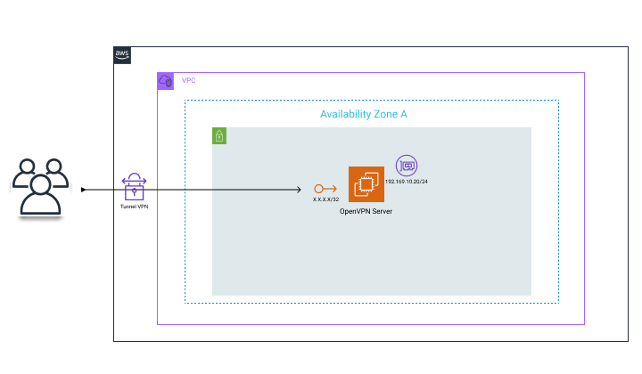

<h1 style='text-align: center'>OpenVPN AWS Lab</h1>


# Steps

[ X ] - provision an EC2 instance with terraform \
[  ] - Install OpenVPN source code on an EC2 instance


# Terraform
- configs locals.tf
```hcl
locals {
  region = "" # região da infraestrutura cloud
  profile = "" # profile default ou personalizado em seu .aws/credentials
}
```